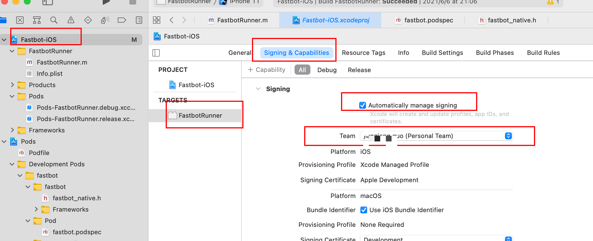
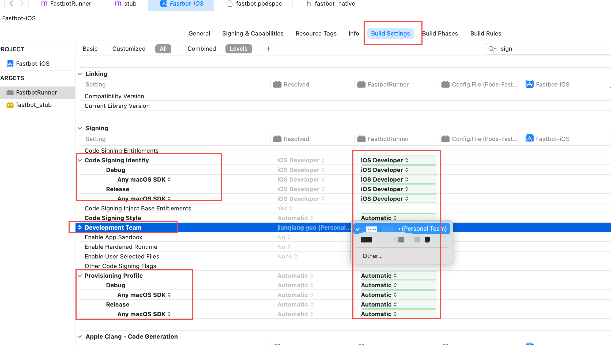
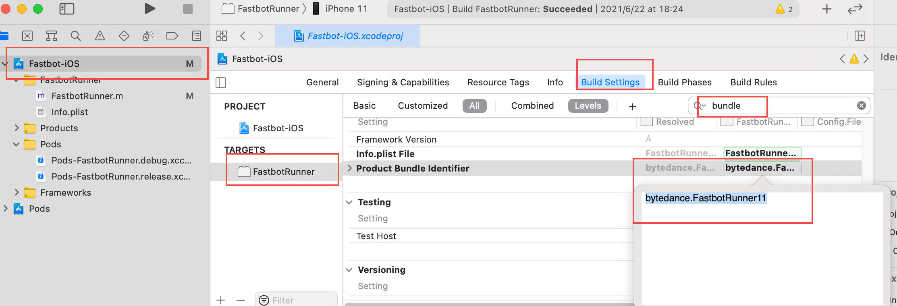
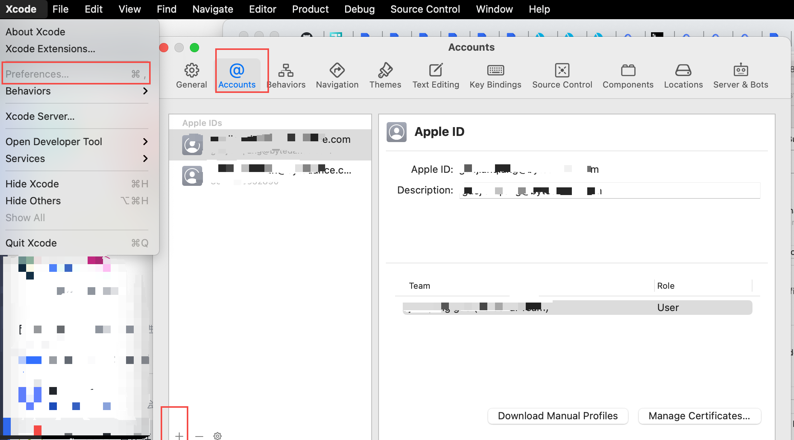
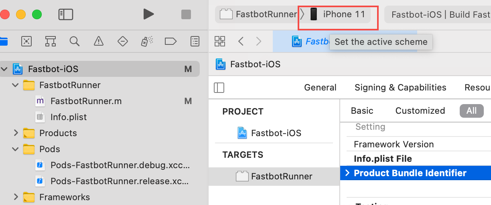
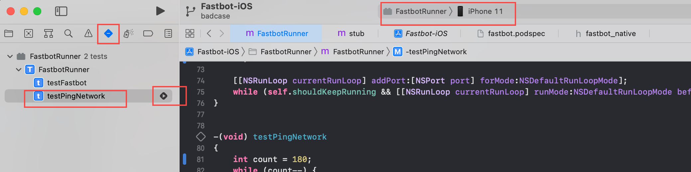
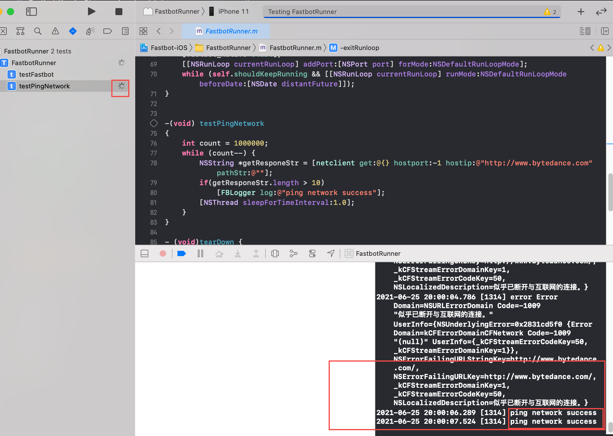
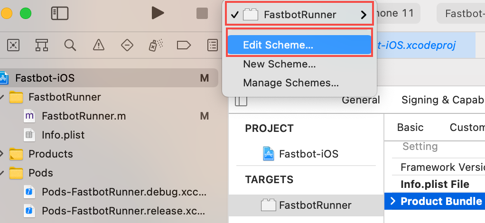
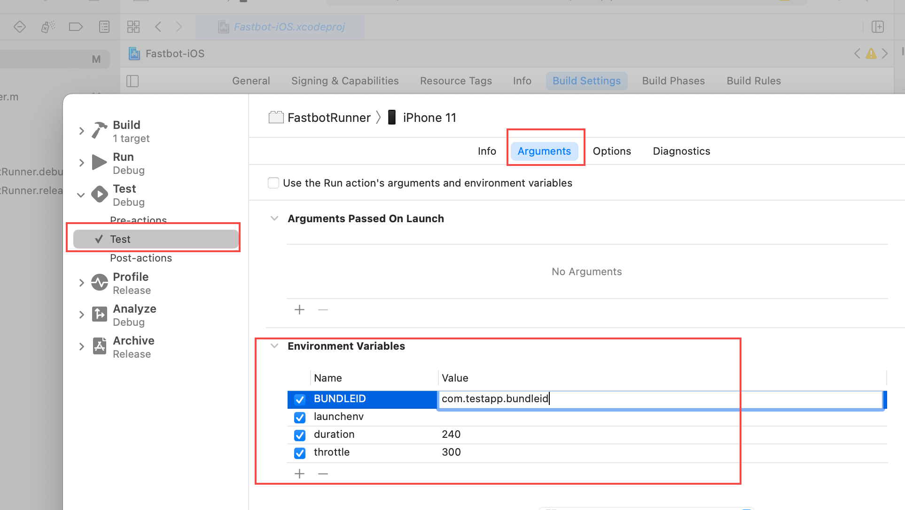
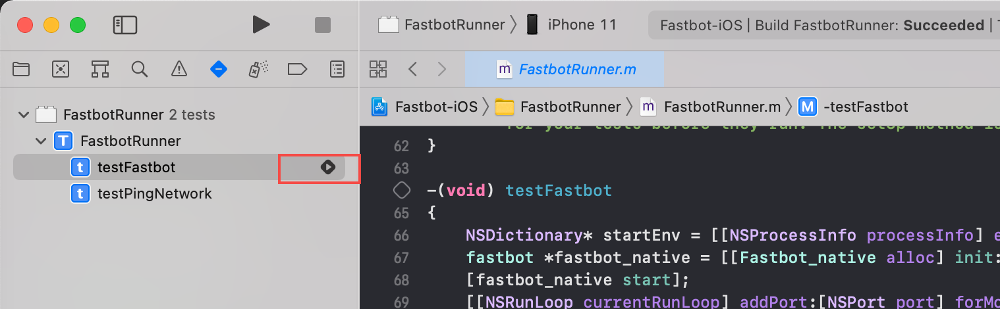

针对新手的更详细的补充使用手册：

--------

## 环境准备（一次性工作）
如果已有对应环境则跳过相关步骤即可。
1. osx 环境：准备 Mac 机器
   * xcode 环境： [下载安装 XcodeIDE](https://developer.apple.com/xcode/resources/)
   * 安装 cocoapods： 在终端中执行 `sudo gem install cocoapods -v=1.8.1` ， 并按提示输入设备登录密码
2. 初始化项目:  
   * 在终端 cd 到当前项目目录下, 然后执行 `cd Fastbot-iOS && pod install --repo-update`
   * 打开项目：双击使用 XCode 打开项目目录下 `Fastbot-iOS/Fastbot-iOS.xcworkspace`
   * 设置签名：设置签名为`自动签名`, 修改`Bundle ID`为自己的 bundleid, 注意这里的BundleId必须是唯一的。  
   * 如果 xcode 中还未登录账号，请在Xcode的设置 中登录账号，如果还没有苹果账号，请先到[苹果官网](https://appleid.apple.com/account)注册一个账号
3. 信任设备&Runner：
   * 信任设备：连接手机到电脑，并在手机中弹出的对话窗中选择`信任`，然后在 XcodeIDE 中选择构建目标为连接的设备或模拟器
   * 信任 FastbotRunner 工具: 执行 `pingTestNetwork`，待 FastbotRunner 安装成功后， 然后在手机 `设置-通用-设备管理-开发者App`中信任 FastbotRunner的证书。
 
4. 打开 FastbotRunner 网络权限： 执行 `pingTestNetwork`（此处可参照步骤3-2），此时在手机上点击 `FastbotRunner-Runner` App，弹出黑色界面后，等待 30s 左右，点击 Home 键（或屏幕底部上滑）回到桌面，此时弹出是否打开网络权限的弹窗，选择无线网络或蜂窝网即可。直到 Xcode 运行 log 中出现 `ping network success` 则打开网络成功，如果不成功可尝试重复步骤4 
-----

-----
## 开始测试
1. 确定被测试App已经安装到设备中，并且可正常运行（即已经信任，如果是未信任可参照环境准备中的步骤3-2信任证书）
2. 在运行 Scheme 中设置测试参数，参数含义参照下表：

|字段|说明|示例|
|--|--|--|
| BUNDLEID|被测试App的 Bundle ID|com.apple.Pages
|duration|测试时长，单位分钟| 240
|launchenv|启动测试App的环境变量，一般为空，或者以 ':'分割的key=value形式|isAutoTestUI=1:channel=AutoTest
|throttle|操作间隔，单位毫秒|300

3. 执行测试，然后可在手机上观测到被测试App已经被拉起，并开始自动执行操作。 